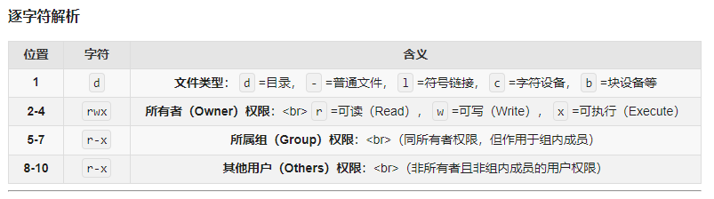

# Linux文件权限阅读

### 例子：

**drwxr-xr-x**

<mark>注：x是执行权限的意思</mark>

d：文件类型标识
rwx：所有者（Owner）权限
r-x：所属组（Group）权限
r-x：其他用户（Others）权限

### **示例解析：drwxr-xr-x**：
d → 这是一个目录（如果是文件则显示 -）。
rwx → 所有者可读、可写、可进入（目录的 x 表示可 cd 进入）。
r-x → 组内成员可读、可进入，但不可写（缺少 w）。
r-x → 其他用户权限与组内成员相同。
